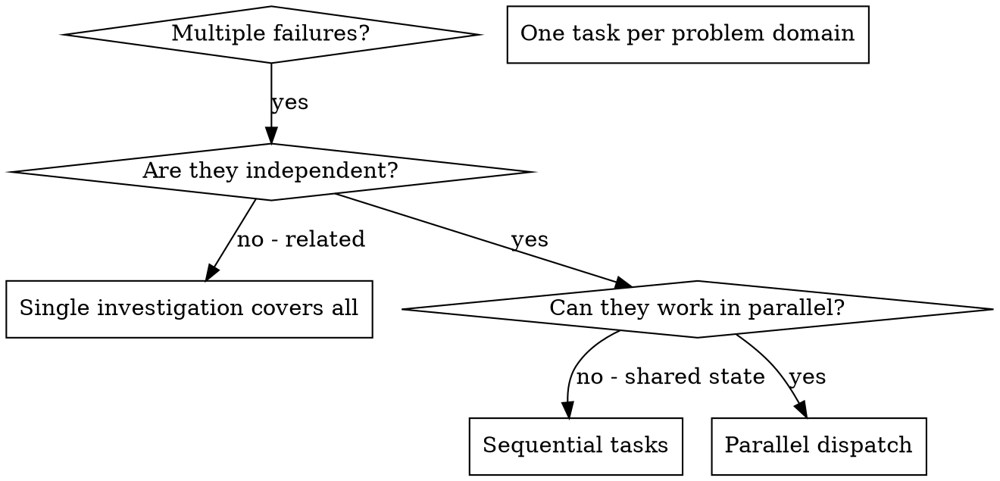

# Dispatching Parallel Agents

## Overview

When you have multiple unrelated failures (different test files, different subsystems, different bugs), investigating them sequentially wastes time. Each investigation is independent and can happen in parallel.

**Core principle:** Dispatch one focused task per independent problem domain. Let them work concurrently.

## When to Use



**Use when:**

- 3+ test files failing with different root causes
- Multiple subsystems broken independently
- Each problem can be understood without context from others
- No shared state between investigations

**Don't use when:**

- Failures are related (fix one might fix others)
- Need to understand full system state
- Tasks would interfere with each other

## The Pattern

### 1. Identify Independent Domains

Group failures by what's broken:

- File A tests: Tool approval flow
- File B tests: Batch completion behavior
- File C tests: Abort functionality

Each domain is independent - fixing tool approval doesn't affect abort tests.

### 2. Create Focused Task Descriptions

Each task gets:

- **Specific scope:** One test file or subsystem
- **Clear goal:** Make these tests pass
- **Constraints:** Don't change other code
- **Expected output:** Summary of what you found and fixed

### 3. Execute in Parallel

If the AI platform supports parallel execution, dispatch all tasks concurrently. Otherwise, execute sequentially but maintain isolation between tasks.

```
Task 1: "Fix agent-tool-abort.test.ts failures"
Task 2: "Fix batch-completion-behavior.test.ts failures"
Task 3: "Fix tool-approval-race-conditions.test.ts failures"
```

### 4. Review and Integrate

When tasks return:

- Read each summary
- Verify fixes don't conflict
- Run full test suite
- Integrate all changes

## Task Description Structure

Good task descriptions are:

1. **Focused** - One clear problem domain
2. **Self-contained** - All context needed to understand the problem
3. **Specific about output** - What should be returned?

```markdown
Fix the 3 failing tests in src/agents/agent-tool-abort.test.ts:

1. "should abort tool with partial output capture" - expects 'interrupted at' in message
2. "should handle mixed completed and aborted tools" - fast tool aborted instead of completed
3. "should properly track pendingToolCount" - expects 3 results but gets 0

These are timing/race condition issues. Your task:

1. Read the test file and understand what each test verifies
2. Identify root cause - timing issues or actual bugs?
3. Fix by:
   - Replacing arbitrary timeouts with event-based waiting
   - Fixing bugs in abort implementation if found
   - Adjusting test expectations if testing changed behavior

Do NOT just increase timeouts - find the real issue.

Return: Summary of what you found and what you fixed.
```

## Common Mistakes

**❌ Too broad:** "Fix all the tests" - gets lost
**✅ Specific:** "Fix agent-tool-abort.test.ts" - focused scope

**❌ No context:** "Fix the race condition" - doesn't know where
**✅ Context:** Paste the error messages and test names

**❌ No constraints:** Might refactor everything
**✅ Constraints:** "Do NOT change production code" or "Fix tests only"

**❌ Vague output:** "Fix it" - you don't know what changed
**✅ Specific:** "Return summary of root cause and changes"

## When NOT to Use

**Related failures:** Fixing one might fix others - investigate together first
**Need full context:** Understanding requires seeing entire system
**Exploratory debugging:** You don't know what's broken yet
**Shared state:** Tasks would interfere (editing same files, using same resources)

## Real Example

**Scenario:** 6 test failures across 3 files after major refactoring

**Failures:**

- agent-tool-abort.test.ts: 3 failures (timing issues)
- batch-completion-behavior.test.ts: 2 failures (tools not executing)
- tool-approval-race-conditions.test.ts: 1 failure (execution count = 0)

**Decision:** Independent domains - abort logic separate from batch completion separate from race conditions

**Dispatch:**

```
Task 1 → Fix agent-tool-abort.test.ts
Task 2 → Fix batch-completion-behavior.test.ts
Task 3 → Fix tool-approval-race-conditions.test.ts
```

**Results:**

- Task 1: Replaced timeouts with event-based waiting
- Task 2: Fixed event structure bug (threadId in wrong place)
- Task 3: Added wait for async tool execution to complete

**Integration:** All fixes independent, no conflicts, full suite green

## Verification

After tasks return:

1. **Review each summary** - Understand what changed
2. **Check for conflicts** - Did tasks edit same code?
3. **Run full suite** - Verify all fixes work together
4. **Spot check** - Automated agents can make systematic errors
