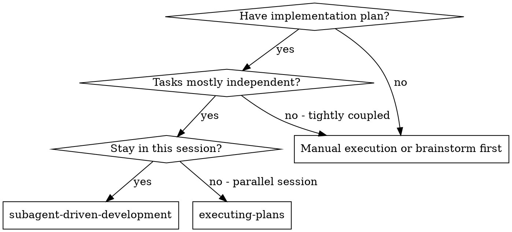
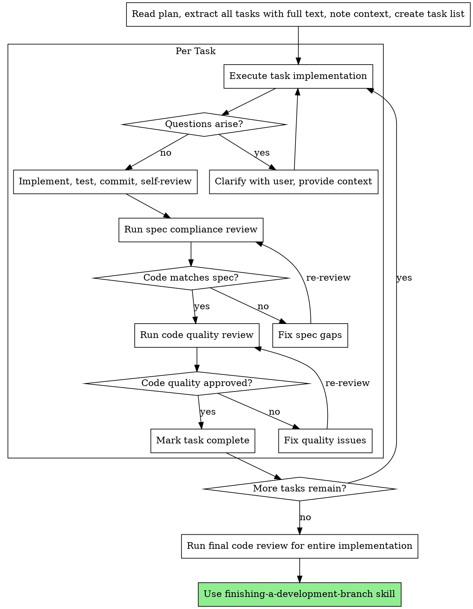

# Subagent-Driven Development

Execute plan by dispatching focused task agents per task, with two-stage review after each: spec compliance review first, then code quality review.

**Core principle:** Fresh task context per task + two-stage review (spec then quality) = high quality, fast iteration

## When to Use



**vs. Executing Plans (parallel session):**

- Same session (no context switch)
- Fresh task context per task (no context pollution)
- Two-stage review after each task: spec compliance first, then code quality
- Faster iteration (no human-in-loop between tasks)

## The Process



## Prompt Templates

If available, use prompt templates for structured reviews:

- `./implementer-prompt.md` - Implementation task prompt
- `./spec-reviewer-prompt.md` - Spec compliance review prompt
- `./code-quality-reviewer-prompt.md` - Code quality review prompt

## Example Workflow

```
You: I'm using Subagent-Driven Development to execute this plan.

[Read plan file once: docs/plans/feature-plan.md]
[Extract all 5 tasks with full text and context]
[Create task list with all tasks]

Task 1: Hook installation script

[Get Task 1 text and context (already extracted)]
[Start implementation with full task text + context]

Questions: "Before I begin - should the hook be installed at user or system level?"

User: "User level (~/.config/app/hooks/)"

Agent: "Got it. Implementing now..."
[Later]:
  - Implemented install-hook command
  - Added tests, 5/5 passing
  - Self-review: Found I missed --force flag, added it
  - Committed

[Run spec compliance review]
Spec review: ✅ Spec compliant - all requirements met, nothing extra

[Run code quality review]
Code review: Strengths: Good test coverage, clean. Issues: None. Approved.

[Mark Task 1 complete]

Task 2: Recovery modes

[Get Task 2 text and context (already extracted)]
[Start implementation with full task text + context]

Agent: [No questions, proceeds]
  - Added verify/repair modes
  - 8/8 tests passing
  - Self-review: All good
  - Committed

[Run spec compliance review]
Spec review: ❌ Issues:
  - Missing: Progress reporting (spec says "report every 100 items")
  - Extra: Added --json flag (not requested)

[Fix issues]
Agent: Removed --json flag, added progress reporting

[Spec review again]
Spec review: ✅ Spec compliant now

[Run code quality review]
Code review: Strengths: Solid. Issues (Important): Magic number (100)

[Fix issues]
Agent: Extracted PROGRESS_INTERVAL constant

[Code review again]
Code review: ✅ Approved

[Mark Task 2 complete]

...

[After all tasks]
[Run final code review]
Final reviewer: All requirements met, ready to merge

Done!
```

## Advantages

**vs. Manual execution:**

- Follow TDD naturally
- Fresh context per task (no confusion)
- Two-stage review catches issues
- Can ask questions (before AND during work)

**vs. Executing Plans:**

- Same session (no handoff)
- Continuous progress (no waiting)
- Review checkpoints automatic

**Quality gates:**

- Self-review catches issues before handoff
- Two-stage review: spec compliance, then code quality
- Review loops ensure fixes actually work
- Spec compliance prevents over/under-building
- Code quality ensures implementation is well-built

## Red Flags

**Never:**

- Skip reviews (spec compliance OR code quality)
- Proceed with unfixed issues
- Implement multiple tasks in parallel (conflicts)
- Skip scene-setting context
- Ignore questions (answer before proceeding)
- Accept "close enough" on spec compliance
- Skip review loops (reviewer found issues = fix = review again)
- Let self-review replace actual review (both are needed)
- **Start code quality review before spec compliance is ✅** (wrong order)
- Move to next task while either review has open issues

**If questions arise:**

- Answer clearly and completely
- Provide additional context if needed
- Don't rush into implementation

**If reviewer finds issues:**

- Fix them
- Review again
- Repeat until approved
- Don't skip the re-review

## Integration

**Required workflow skills:**

- **writing-plans** - Creates the plan this skill executes
- **requesting-code-review** - Code review template for review steps
- **finishing-a-development-branch** - Complete development after all tasks

**Should use:**

- **test-driven-development** - Follow TDD for each task

**Alternative workflow:**

- **executing-plans** - Use for parallel session instead of same-session execution
